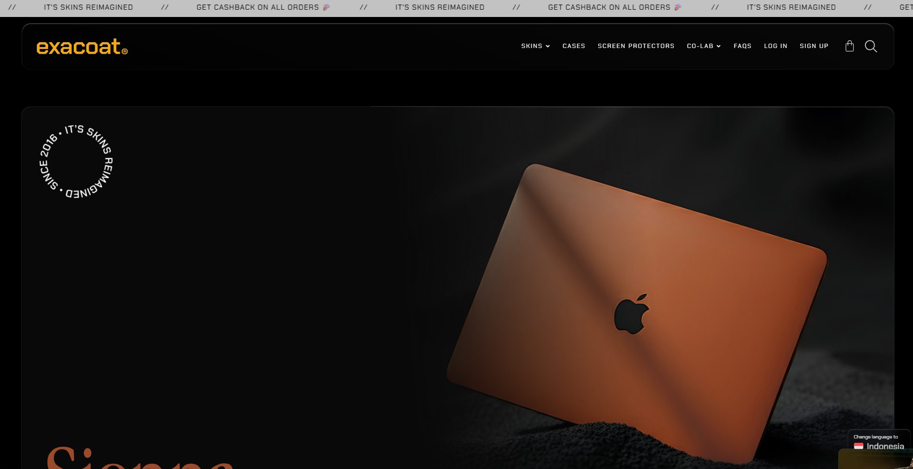

# Skinify


> 📇 **Skinify** - A web application that allows users to customize their phone's or gadget's appearance.

Skinify is an application designed to help users personalize their devices with various skins and themes. Whether you want to give your phone a fresh look or match your gadget to your style, Skinify has got you covered.

## 🔗 Links

**Links:**

- Frontend: <https://skinify.mchmdirvan.com>
- Backend API: <https://skinify-api.mchmdirvan.com>

**Repositories:**

- Main: <https://github.com/mchmdirvan/skinify>
- Backend API: <https://github.com/mchmdirvan/skinify-api>
- Frontend Web: <https://github.com/mchmdirvan/skinify-web>

**Inspiration:**

[Exacoat](https://exacoat.com)


## 🛠️ Architecture & Tech Stack

### Client | Presentation Layer (UI)

- React Router Frmamework V7
- TypeScript
- Tailwind CSS
- Shadcn UI
- React Hook Form
- Zod

### Server | Application Layer (Business Logic)

- JavaScript
- TypeScript
- Hono
- OpenAPI
- Zod
- Docker

### Data Access Layer (Database)

- Prisma
- PostgreSQL
- Docker

## ✨ Features

### Core Pages

- **Home Page**
  - Hero section with featured products
  - Call-to-action buttons linking to brand-specific pages
  - Product advantages highlighting key benefits
  - Customer review section with ratings and testimonials
- **Brand Pages**
  - List of brands and links to their models
- **Model Pages**
  - List of models and links to their products
- **Product Details**
  - High-quality product images
  - Product specifications (name, brand, price)
  - Add to cart functionality
- **Shopping Cart**
  - Item management (view, update quantity, remove)
  - Price calculations and totals
  - Continue shopping or proceed to checkout
- **Checkout**
  - Order summary with itemized list
  - Grand total calculation
  - Order processing workflow

## 📊 Database Schema


## 🚀 API Documentation

- Production: `https://skinify-api.mchmdirvan.com`
- Development: `http://localhost:3000`

### REST API Endpoints

Products:

| Endpoint          | HTTP  | Description         |
| ----------------- | ----- | ------------------- |
| `/brands`         | `GET` | Get all brands      |
| `/brands/:slug`   | `GET` | Get brand by slug   |
| `/models`         | `GET` | Get all models      |
| `/models/:slug`   | `GET` | Get model by slug   |
| `/products`       | `GET` | Get all products    |
| `/products/:slug` | `GET` | Get product by slug |

Auth:

| Endpoint         | HTTP   | Permission    |
| ---------------- | ------ | ------------- |
| `/users`         | `GET`  | Public        |
| `/users/:id`     | `GET`  | Public        |
| `/auth/register` | `POST` | Public        |
| `/auth/login`    | `POST` | Public        |
| `/auth/me`       | `GET`  | Authenticated |
| `/cart`          | `GET`  | Authenticated |
| `/cart/items`    | `POST` | Authenticated |

### Data Models

**Product Schema:**

```json
{
  "id": "cmepf0pr7002kc6vk78gucth9",
  "slug": "iphone-16-skins-patina",
  "name": "iPhone 16 Skins - Patina",
  "sku": "SKINIFY-IP16-PATINA",
  "imageUrl": "https://ucarecdn.com/0889b6da-b6f5-4021-b040-f81bda338d88/4.png",
  "stockQuantity": 100,
  "price": 159000,
  "modelSlug": "iphone-16",
  "createdAt": "2025-08-24T08:17:24.835Z",
  "updatedAt": "2025-08-24T08:17:24.835Z"
}
```

**Create Product Request:**

```json
{
  "name": "iPhone 16 Skins - Patina",
  "sku": "SKINIFY-IP16-PATINA",
  "imageUrl": "https://ucarecdn.com/0889b6da-b6f5-4021-b040-f81bda338d88/4.png",
  "stockQuantity": 100,
  "price": 159000,
  "modelSlug": "iphone-16"
}
```
